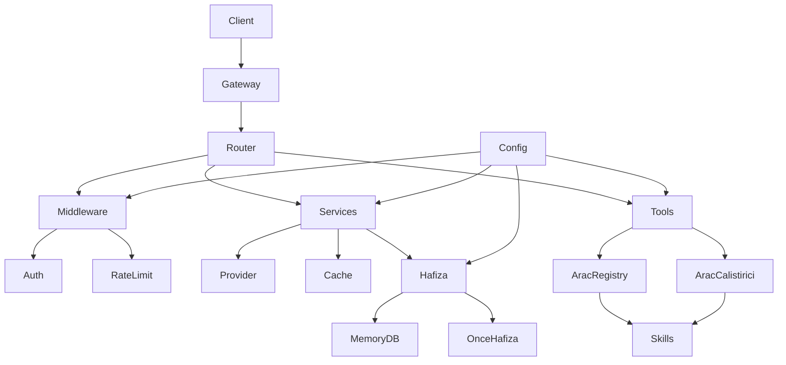

# ReYMeN Proje Mimarisi

> ReYMeN Gateway Sistemi — Modüler Yapı Diyagramı



## Katmanlar

| Katman | Dizin | Sorumluluk |
|--------|-------|------------|
| **Gateway** | `gateway/` | HTTP/TUI giriş noktası, routing |
| **Router** | `reymen/cereyan/` | Motor, iş akışı yönetimi |
| **Middleware** | `reymen/guvenlik/` | Auth, rate-limit, güvenlik |
| **Tools** | `reymen/arac/` + `tools/` | Araç kaydı, çalıştırma |
| **Services** | `reymen/sistem/` | Provider, cache, config |
| **Hafiza** | `reymen/hafiza/` | Bellek katmanları (MemoryDB, OnceHafiza) |
| **Skills** | `reymen/cereyan/skills/Skiller/` | 37 kategoride 2,831 skill |

## Bağımlılık Yönü

```
Config → Tools → Services → Hafiza
     ↘        ↘          ↘
      Middleware → Router → Gateway → Client
```

**Kural:** Alt katman üst katmanı import edemez. Config her yere gidebilir.

## Büyük Dosya Durumu

| Dosya | Satır | Statü | Plan |
|-------|:-----:|:-----:|------|
| `gateway/run.py` | 19,669 | 🔴 Upstream | Dokunulmayacak |
| `reymen/sistem/cli.py` | 16,038 | 🔴 Upstream | Dokunulmayacak |
| `tui_gateway/server.py` | 7,845 | 🔴 Upstream | Dokunulmayacak |
| `reymen/cereyan/motor.py` | **2,048** | 🟡 Refactor hedefi | Bölünecek |
